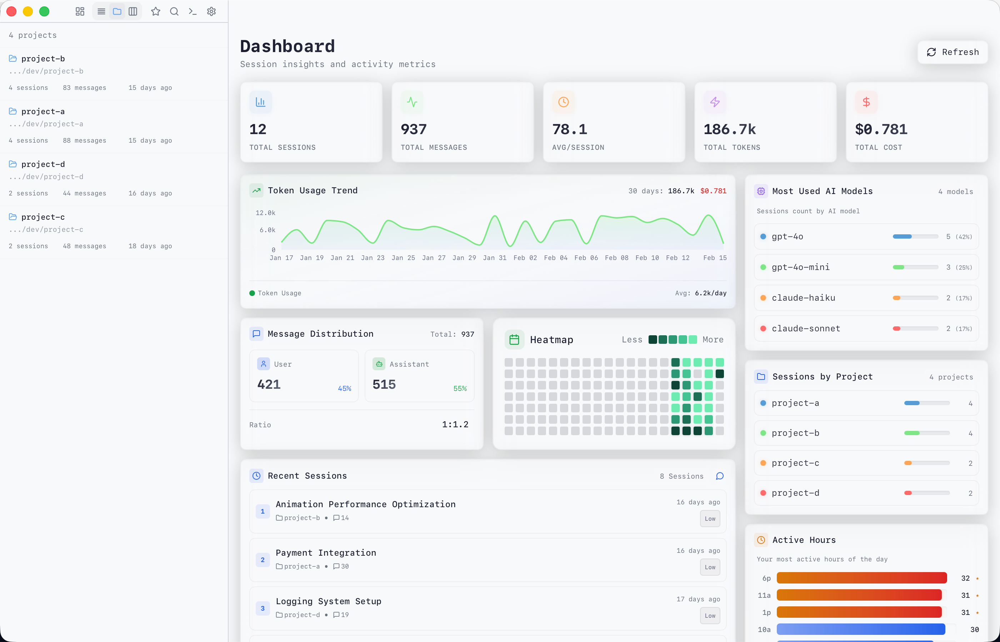

<p align="center">
  
</p>

<h1 align="center">Pi Session Manager</h1>

<p align="center">
  Cross-platform Pi AI session management tool — Browse, search, and manage <a href="https://github.com/badlogic/pi-mono">Pi</a> programming sessions
</p>

<p align="center">
  
  
  
</p>

<p align="center">
  <a href="https://github.com/Dwsy/pi-session-manager/releases/latest">⬇️ Download</a> ·
  <a href="https://dwsy.github.io/pi-session-manager/">📖 Documentation</a> ·
  <a href="https://dwsy.github.io/pi-session-manager/cn/">📖 中文文档</a>
</p>

<p align="center">
  <picture>
    <source media="(prefers-color-scheme: dark)" srcset="https://github.com/user-attachments/assets/4cb92d95-f50e-48d2-8c5e-4bb814d45b8f" />
    <source media="(prefers-color-scheme: light)" srcset=".github/screenshots/screenshot-light.png" />
    
  </picture>
</p>

---

## Features

- **Cross-Platform** — Desktop app (macOS/Windows/Linux) + Mobile Web + Headless server mode
- **Session Browser** — List/Project/Kanban views, favorites, rename, batch export
- **Full-Text Search** — SQLite FTS5 powered, role filtering, path matching, relevance ranking
- **Session Viewer** — Tree view, collapsible tool calls, chain-of-thought display, flow visualization
- **Appearance Customization** — Dark/Light/System + Custom Pi theme preset mode, with separate UI and monospace font controls
- **Built-in Terminal** — xterm.js + PTY backend (`Cmd/Ctrl+J`)
- **Dashboard** — Activity heatmap, project distribution, model usage, token consumption stats
- **Skill Management** — Scan and manage `~/.pi/agent/skills` and prompts, system prompt editor
- **Multi-Protocol API** — Desktop defaults: WebSocket (`ws://127.0.0.1:52130`) + HTTP (`http://127.0.0.1:52131/api`); `pi-session-cli` serves HTTP + WebSocket (`/ws`) on one port (`52131` by default)
- **CLI Mode** — Headless backend service (`--cli` / `--headless`)

---

## Download

Get the latest version from [**Releases**](../../releases):

| Platform | File |
|------|------|
| macOS (Apple Silicon) | `Pi.Session.Manager_*_aarch64.dmg` |
| macOS (Intel) | `Pi.Session.Manager_*_x64.dmg` |
| Windows (x64) | `Pi.Session.Manager_*_x64-setup.exe` |
| Linux (deb) | `pi-session-manager_*_amd64.deb` |

> **Prerequisites**: [Pi](https://github.com/badlogic/pi-mono) must be installed for session restoration and terminal integration

---

## Quick Start

### Desktop App

```bash
./pi-session-manager
```

### Server Mode (`pi-session-manager --cli`)

```bash
./pi-session-manager --cli
# defaults: WS=52130, HTTP=52131

# custom HTTP host/port (WS still uses configured ws_port, default 52130)
./pi-session-manager --cli -p 18080 -b 0.0.0.0
# Access UI at http://localhost:18080
```

### Standalone CLI Binary (`pi-session-cli`)

```bash
./pi-session-cli
# single-port server: HTTP + WebSocket (/ws) on 52131 by default
./pi-session-cli -p 18080 -b 0.0.0.0
```

CLI flags (`pi-session-manager --cli`):
- `-h`, `--help`: show help
- `-p`, `--port <PORT>`: set HTTP port only
- `-b`, `--bind <ADDR>`: set bind address
- `--auth` / `--no-auth`: temporarily enable/disable auth (CLI overrides config)
- `--token <TOKEN>`: runtime-only token for current process (not persisted, overrides DB tokens)

`pi-session-cli` also supports `-p`, but there it controls the single shared HTTP+WS port (`/ws`).

Default behavior: auth is enabled in CLI mode; loopback (`localhost`/`127.0.0.1`) is exempt, non-loopback requests require a token.

### Build from Source

```bash
git clone https://github.com/Dwsy/pi-session-manager.git
cd pi-session-manager

npm install
npm run tauri:dev        # Development
npm run tauri:build      # Production build
```

**System Dependencies**:
- **macOS**: `xcode-select --install`
- **Ubuntu/Debian**: `sudo apt-get install libwebkit2gtk-4.1-dev libappindicator3-dev librsvg2-dev`
- **Windows**: Visual Studio Build Tools + WebView2

---

## Keyboard Shortcuts

| Shortcut | Action |
|--------|------|
| `Cmd/Ctrl + K` | Command Palette |
| `Cmd/Ctrl + J` | Toggle Terminal |
| `Cmd/Ctrl + F` | Session Search |
| `Cmd/Ctrl + Shift + F` | Full-Text Search |
| `Cmd/Ctrl + R` | Restore Session in Terminal |
| `Cmd/Ctrl + E` | Export and Open |
| `Cmd/Ctrl + ,` | Settings |

---

## Tech Stack

| Layer | Technology |
|------|------|
| **Frontend** | React 18, TypeScript, Vite, Tailwind CSS, xterm.js, Recharts, React Flow |
| **Backend** | Tauri 2, Rust, Tokio, Axum, SQLite, Tantivy, portable-pty |
| **Communication** | Tauri IPC, WebSocket, HTTP |

---

## Configuration Paths

| Path | Description |
|------|------|
| `~/.pi/agent/sessions/` | Pi session directory |
| `~/.pi/agent/session-manager.db` | SQLite cache |
| `~/.pi/agent/session-manager-config.toml` | Configuration file |
| `~/.pi/agent/themes/` | Custom Pi theme presets |

---

## Contributing

```bash
cd src-tauri && cargo fmt && cargo clippy
cd src-tauri && cargo test
```

Please follow [Conventional Commits](https://www.conventionalcommits.org/) for PR submissions.

---

## License

[MIT](LICENSE)
