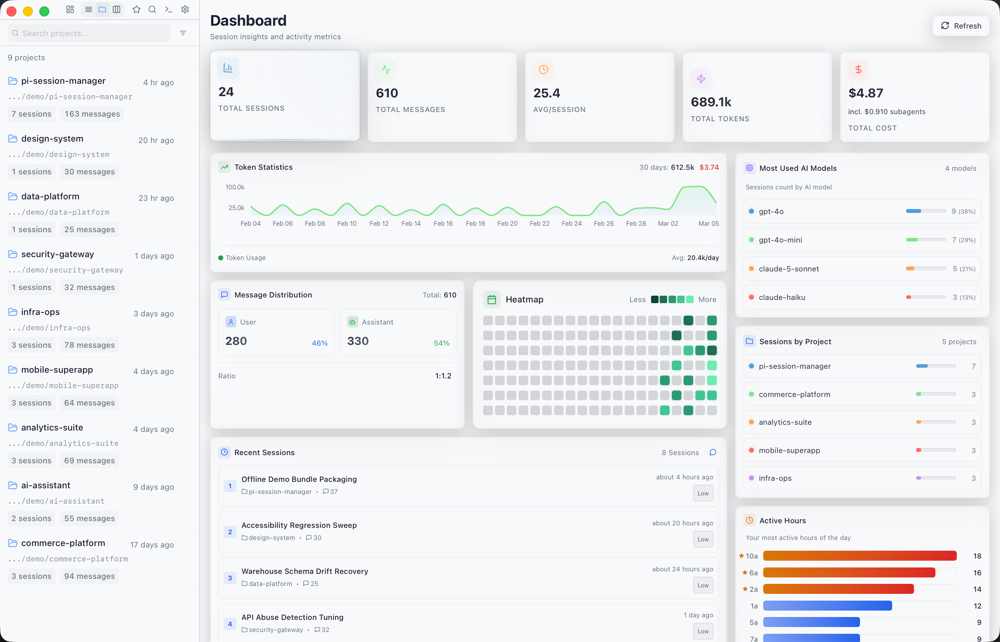
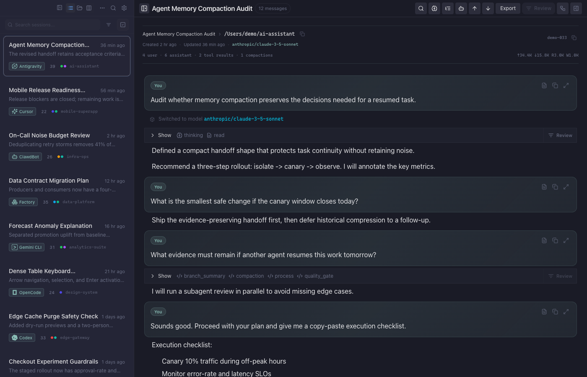
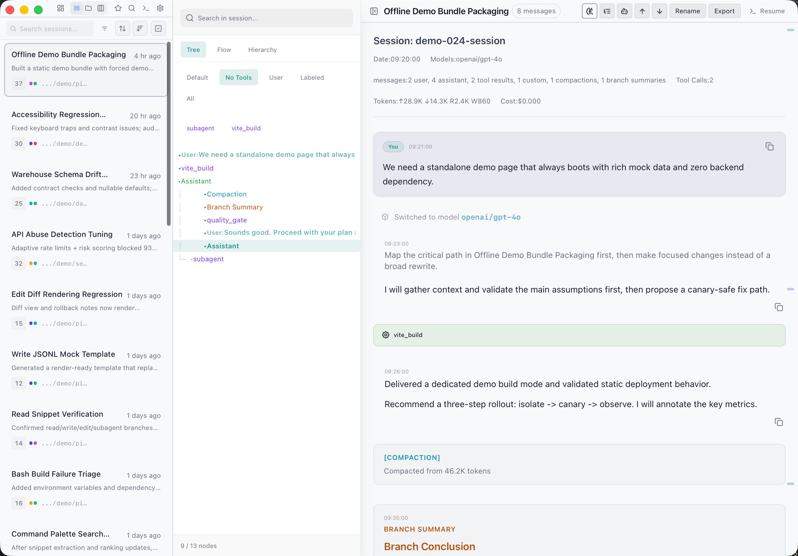
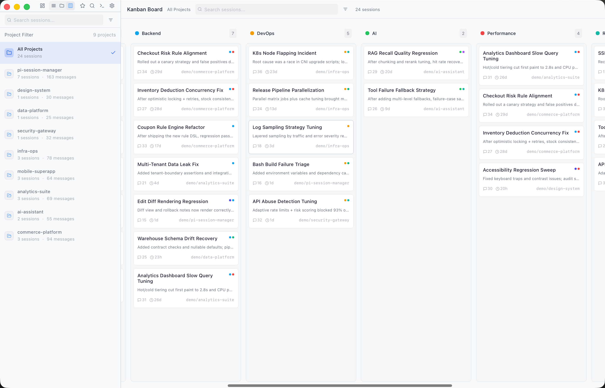

# Pi Session Manager

<p align="center">
  
</p>

<h1 align="center">Pi Session Manager</h1>

<p align="center">
  Manage <a href="https://github.com/badlogic/pi-mono">Pi</a> coding sessions with a Tauri desktop app, browser-accessible server mode, and a standalone static demo page.
</p>

<p align="center">
  <a href="https://github.com/Dwsy/pi-session-manager/releases/latest">Releases</a> ·
  <a href="https://dwsy.github.io/pi-session-manager/">Documentation</a> ·
  <a href="https://dwsy.github.io/pi-session-manager/cn/">中文文档</a> ·
  <a href="https://dwsy.github.io/pi-session-manager/demo/">Preview</a>
</p>

## Highlights

- Session browser with list/project/kanban views, favorites, tags, rename, delete, and export.
- Full-text search via SQLite FTS + Tantivy-backed indexing/search flows.
- In-session message search with inline highlights, current-match navigation, and keyboard-friendly close/reset behavior. `Cmd/Ctrl + F` behavior is configurable (search vs. sidebar toggle).
- Built-in terminal (PTY) and one-click resume of Pi sessions.
- Multi-protocol runtime: Tauri IPC, WebSocket, HTTP, SSE.
- Rich **demo data engine** and dedicated static demo page build mode.
- i18n packs: `en-US`, `zh-CN`, `ja-JP`, `de-DE`, `fr-FR`, `es-ES`.
- Pi Live integration with real-time session sync and model control.
- Analytics dashboard with activity heatmap, token trends, and subagent cost stats.

## Architecture

```
Frontend: React + TypeScript + Vite
Backend: Rust + Tauri 2 + Axum + SQLite + Tantivy

Protocols: Tauri IPC | WebSocket (/ws) | HTTP (/api) | SSE
```

### Four-Layer Design

```
Commands (thin) <- Tauri IPC / HTTP / WS
Domain (business) <- model_config, session_list, stats, terminal
Data <- search (Tantivy) sqlite (cache)
Server (protocol) <- HTTP adapter, WebSocket adapter
```

### Tech Stack

| Layer | Tech |
|-------|------|
| Frontend | React 18, TypeScript 5, Vite 5, Tailwind CSS, i18next, cmdk, @dnd-kit, @xyflow/react, recharts, @xterm/xterm |
| Backend | Rust 2021, Tauri 2, Tokio, Axum, rusqlite, Tantivy, notify, portable-pty |
| Protocol | Tauri IPC · WebSocket (/ws) · HTTP (/api) · SSE (/api/events) |

### Code Scale

| Module | Language | Scale |
|--------|----------|-------|
| Frontend Components | TypeScript/React | 155+ components |
| Frontend Hooks | TypeScript | 40+ hooks |
| Backend | Rust | ~27K lines |

## UI Preview

| Home | Session Page |
|------|-------------|
|  |  |

| Session Tree | Kanban |
|-------------|--------|
|  |  |

## Quick Start

### Prerequisites

- Node.js 20+
- Rust stable (via `rustup`)
- Platform toolchains for Tauri (Xcode / WebView2 / WebKitGTK)

### Install

```bash
git clone https://github.com/Dwsy/pi-session-manager.git
cd pi-session-manager
pnpm install
```

### Common Commands

| Command | Description |
|---------|-------------|
| `npm run dev` | Frontend dev server |
| `npm run tauri:dev` | Full desktop dev (frontend + Rust) |
| `npm run build` | Production frontend build to `dist/` |
| `npm run build:demo` | Static demo build to `dist-demo/` |
| `npm run build:cli` | Build standalone `pi-session-cli` binary |
| `npm run tauri:build` | Desktop production bundle |

## Runtime Modes

| Mode | Entry | Network behavior |
|------|-------|------------------|
| Desktop GUI | `pi-session-manager` | GUI + backend services; unified single-port HTTP + WS(`/ws`) on `http_port` (default `52131`) |
| Headless in main binary | `pi-session-manager --cli` / `--headless` | Single-port HTTP + WS(`/ws`) on `http_port` (default `52131`) |
| Standalone CLI crate | `pi-session-cli` | Single-port HTTP + WS(`/ws`) (default `52131`) |
| Static demo page | `dist-demo/index.html` | No backend required, forced demo data |

### CLI Flags

- `-p, --port <PORT>`: shared HTTP+WS port in CLI mode
- `-b, --bind <ADDR>`: bind address
- `--auth` / `--no-auth`: enable/disable auth
- `--token <TOKEN>`: runtime-only token for current process

## API Surface

| Endpoint | Method | Description |
|----------|--------|-------------|
| `/api` | POST | Command endpoint |
| `/ws` | GET | WebSocket |
| `/api/events` | GET | SSE events |
| `/health` | GET | Health check |
| `/` | GET | Embedded frontend |

## Paths & Storage

| Path | Description |
|------|-------------|
| `~/.pi/agent/sessions/` | Session directory |
| `~/.pi/agent/sessions/sessions.db` | SQLite DB (sessions, settings, tags, favorites, auth tokens) |
| `~/.pi/agent/session-manager-config.toml` | Scanner config (`session_paths`, FTS, intervals, etc.) |
| `~/.pi/agent/skills/` | Pi skills |
| `~/.pi/agent/prompts/` | Pi prompts |
| `~/.pi/agent/settings.json` | Pi settings |
| `~/.config/pi-session-manager.json` | Standalone `pi-session-cli` config |

## Extension System

### Pi Plugin (pi-session-bridge)

```
extensions/pi-session-bridge/index.ts
```

### Tool Render Plugins

```
src/plugins/tools-render/
├── builtins/    # bash, edit, read, write, generic
└── extensions/  # subagent, ...
```

### Search Plugins

```
src/plugins/
├── message/     # In-message search
├── project/     # Project search
└── session/     # Session search
```

## Development

### Development Checks

```bash
cargo fmt --all --check
cd src-tauri && cargo clippy -- -D warnings
cargo clippy -p pi-session-cli -- -D warnings
cd src-tauri && cargo test
```

### Adding a New Command

1. **Business logic** -> `src-tauri/src/domain/`
2. **Command layer** -> `src-tauri/src/commands/`
3. **Route registration** -> `src-tauri/src/dispatch.rs`
4. **Tauri registration** -> `src-tauri/src/lib.rs`

See [agent-docs/03-backend.md](agent-docs/03-backend.md) for detailed tutorial.

## Documentation

| Document | Description |
|----------|-------------|
| [AGENTS.md](AGENTS.md) | Agent development guide |
| [agent-docs/01-architecture.md](agent-docs/01-architecture.md) | Four-layer architecture |
| [agent-docs/02-frontend.md](agent-docs/02-frontend.md) | Frontend component index |
| [agent-docs/03-backend.md](agent-docs/03-backend.md) | Backend modules + command tutorial |
| [agent-docs/04-development.md](agent-docs/04-development.md) | Build & release |
| [agent-docs/05-config.md](agent-docs/05-config.md) | Config & security |
| [DESIGN.md](DESIGN.md) | Design system (colors, typography, motion) |

## License

MIT

## macOS Installation Note

If macOS shows "App is damaged and can't be opened", run:

```bash
sudo xattr -rd com.apple.quarantine "/Applications/Pi Session Manager.app"
```

This is a standard Gatekeeper behavior for non-App-Store apps. No certificate is required for personal use.
