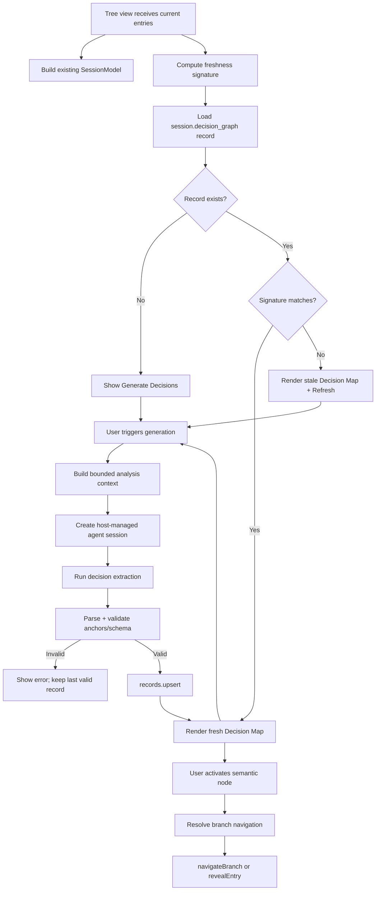

# Session Decision Map — Product, UX, and Implementation Plan

**Date:** 2026-08-07
**Status:** Proposed
**Target:** `extensions/psm-session-graph`
**Primary audience:** PSM maintainers and implementation agents

## 1. Executive decision

Extend the existing built-in `builtin.session-graph` plugin instead of creating a second graph plugin.

The current plugin already owns the truthful session topology, branch projection, selection, and navigation. The new product layer should answer a different question: **what were the important decisions in this agent session, why were they made, what changed because of them, and where is the original evidence?**

The resulting plugin should present two modes inside the same session tree view:

- **Decisions** — semantic decision map; default mode after the plugin is enabled.
- **Topology** — the existing Branch Map; behavior remains intact and serves as the source-of-truth evidence layer.

The plugin must be **default-disabled**. Enabling the plugin must not silently invoke a model. Decision extraction is user-triggered through **Generate** / **Refresh** actions, with explicit stale-state feedback when the session has advanced.

A semantic node is valid only when it is anchored to a real session entry. The semantic graph never replaces the underlying JSONL topology.

## 2. Goals

1. Let a user understand the value of a long agent session without rereading the entire transcript.
2. Surface decisions, checkpoints, outcomes, and unresolved questions rather than every message.
3. Make every semantic claim traceable to real conversation entries.
4. Navigate from a semantic node to the correct branch and source message using existing viewer APIs.
5. Reuse the current Branch Map visual language and topology utilities.
6. Persist generated semantic results as plugin records so reopening a session is cheap and deterministic.
7. Detect when the stored graph is stale without automatically spending model tokens.
8. Preserve all existing Branch Map behavior and user settings.
9. Keep the feature zero-impact when the plugin is disabled.

## 3. Non-goals

- Replacing `src/utils/session-branch` or the existing Branch Map layout engine.
- Rendering every user, assistant, or tool entry as a semantic node.
- Building a second session graph plugin or a second graph style system.
- Automatically running AI analysis in the background whenever entries change.
- Treating model-generated semantics as authoritative when they conflict with session topology.
- Exposing privileged backend dispatch commands directly to plugins.
- Implementing precise “fork from arbitrary checkpoint” in the first slice unless that behavior is explicitly required as a release criterion.

## 4. Current repository baseline

### 4.1 Existing plugin

`extensions/psm-session-graph` already registers the tree view `builtin.session-graph.flow`. `SessionGraphView.tsx` consumes current session entries and delegates topology work to the shared session-branch model.

The existing view already uses:

- `buildSessionBranchModel(...)`
- `resolveBranchNavigation(...)`
- `GlobalMap`
- `AtlasDialog`
- `readBranchMapSettings(...)`
- `writeBranchMapSettings(...)`

This is the correct foundation. The implementation should add a semantic projection above this model, not fork the topology stack.

### 4.2 Built-in discovery

`src/plugins/runtime-host/builtins.ts` automatically discovers `extensions/psm-*/index.{ts,tsx}`. No new manual registration path is required.

### 4.3 Default-enabled behavior

`src/plugins/runtime-host/host.ts::pluginEnabled()` resolves enablement in this order:

1. explicit `plugins.json` override;
2. `manifest.defaultEnabled`;
3. `true`.

The current session-graph manifest does not declare `defaultEnabled: false`, so the plugin currently falls through to enabled. The first implementation slice must make the opt-in behavior explicit and add a regression test matching the `builtin.agent-usage` precedent.

### 4.4 Navigation capability

`PsmSessionViewerController` already exposes:

- `revealEntry(entryId, options)`
- optional `navigateBranch(leafEntryId, targetEntryId, options)`

The current `psm-trace` implementation demonstrates the correct fallback pattern: use `navigateBranch` when available, otherwise `revealEntry`.

This is sufficient for semantic-node-to-source navigation without an SDK change.

### 4.5 Semantic record and agent precedent

`builtin.session-summary` already demonstrates the supported plugin pattern:

```text
sessions.readEntries
  -> agent.createSession / agent.runStream
  -> validate result
  -> records.upsert
  -> session-scoped persisted state
```

Decision Map should follow this pattern rather than introducing a plugin-local persistence mechanism.

### 4.6 Session update events

The runtime SDK exposes generic `ctx.events.subscribe(...)`, but there is no verified typed contract for “session entries changed” that should be treated as the correctness mechanism for this feature.

Decision Map should use the `entries` supplied to the tree-view render path as the current source of truth and derive stale state from those entries.

## 5. Product model

### 5.1 Semantic object types

Keep the semantic vocabulary intentionally small.

#### `decision`

A meaningful choice between alternatives or a commitment to an implementation/product direction.

Examples:

- choosing a plugin extension instead of adding a core screen;
- selecting records over local component state;
- changing an API shape after discovering a compatibility issue.

#### `checkpoint`

A point where the goal, constraints, or execution direction materially changed.

Examples:

- user redirects implementation to planning;
- new evidence invalidates the current approach;
- a blocking dependency changes the next viable path.

#### `outcome`

A result that closes or materially updates an earlier decision.

Examples:

- implementation verified;
- attempted approach failed;
- migration completed;
- selected solution was superseded by later evidence.

#### `open_question`

An unresolved question whose answer can change future work.

These four types are sufficient for the first release. Alternatives should normally be represented in a node summary or as edges instead of adding a fifth node taxonomy.

### 5.2 Semantic edge types

Use only relations that provide decision value:

- `leads_to`
- `depends_on`
- `supersedes`
- `resolves`

Do not reproduce every parent-child message edge. Topology already owns that information.

### 5.3 Source of truth

Every semantic node must include a primary `anchorEntryId` and may include supporting `evidenceEntryIds`.

Rules:

- all referenced entries must exist in the current session;
- all edge endpoints must exist in the semantic record;
- node IDs must be unique;
- AI output cannot invent entry IDs;
- invalid AI output must not overwrite the last valid record;
- semantic state never changes the underlying branch model.

## 6. Proposed persisted record

Declare a session-scoped plugin record in `extensions/psm-session-graph/manifest.ts`.

Recommended record type: `session.decision_graph`.

```ts
interface DecisionGraphRecordPayload {
  schemaVersion: 1
  generatedAt: string
  source: {
    entryCount: number
    lastEntryId: string | null
  }
  nodes: DecisionGraphNode[]
  edges: DecisionGraphEdge[]
}

interface DecisionGraphNode {
  id: string
  kind: 'decision' | 'checkpoint' | 'outcome' | 'open_question'
  title: string
  summary: string
  anchorEntryId: string
  evidenceEntryIds: string[]
  status?: 'active' | 'superseded' | 'resolved' | 'open'
}

interface DecisionGraphEdge {
  from: string
  to: string
  kind: 'leads_to' | 'depends_on' | 'supersedes' | 'resolves'
}
```

### 6.1 Record identity

Use one current record per session and plugin, keyed deterministically by session path, following the session-summary precedent.

The exact ID format is implementation-local, but it must be stable across reopen and refresh operations.

### 6.2 Freshness marker

The first schema should use `entryCount + lastEntryId` as a cheap, deterministic freshness marker.

Fresh when both match the current entries. Stale when either changes.

Do not use timestamps as the primary freshness contract. Session timestamps can change for reasons unrelated to semantic source content and are less precise than the entry sequence itself.

## 7. Decision extraction pipeline

### 7.1 Trigger model

No automatic model calls.

User actions:

- no record -> **Generate Decisions**;
- stale record -> **Refresh**;
- fresh record -> optional **Refresh** for explicit regeneration.

### 7.2 Context preparation

Do not send raw, unbounded tool output to the agent.

Build an analysis context that prioritizes:

- user messages;
- assistant conclusions and decisions;
- branch/compaction boundaries;
- concise tool-result evidence when it materially changed a decision;
- model/provider changes when they explain behavior;
- existing branch labels where useful.

The analysis context builder should be a pure function that can be unit tested independently of the agent call.

### 7.3 Agent contract

Use a host-managed agent session via the plugin SDK.

Prompt requirements:

- output one JSON object only;
- never create an entry ID not supplied in context;
- prefer fewer, high-signal nodes;
- distinguish an actual decision from ordinary execution;
- preserve chronological causality;
- mark superseded decisions rather than deleting history;
- keep titles concise enough for a dense tree view.

### 7.4 Validation

Before `records.upsert`:

1. parse JSON;
2. validate top-level schema;
3. validate unique node IDs;
4. validate node kinds/status values;
5. validate all `anchorEntryId` / `evidenceEntryIds` against current entries;
6. validate edge endpoints;
7. reject self-contradictory or malformed graph structure where detectable;
8. only then persist.

If validation fails, surface an error and retain the previous valid record.

## 8. UX architecture

### 8.1 One plugin, one tree-view contribution

Keep `builtin.session-graph.flow` as the contribution. Do not add a parallel Decision Map tab.

Inside the view, use a compact mode switch:

```text
[ Decisions ] [ Topology ]
```

The selected mode is plugin-local UI state. Preserve existing Branch Map settings for Topology.

### 8.2 Default Decisions layout

The semantic view should feel like a decision trail rather than a generic node editor.

Recommended composition:

```text
┌──────────────────────────────────────┐
│ Decisions  Topology        Refresh   │
│ Session changed · graph is stale     │
├──────────────────────────────────────┤
│ ● Decision                           │
│   Use existing plugin surface        │
│   Reuse Branch Map as evidence       │
│   3 evidence anchors                 │
│          │                           │
│          ├── resolves ──┐            │
│          ▼              │            │
│ ◇ Checkpoint            │            │
│   User redirected to plan-first      │
│          │              │            │
│          ▼              │            │
│ ✓ Outcome ◄─────────────┘            │
│   Architecture plan finalized        │
└──────────────────────────────────────┘
```

The visual priority is text and causality. Avoid an oversized free-pan canvas in the narrow tree panel.

### 8.3 Node presentation

Each node contains:

- type glyph / short label;
- concise title;
- one-line summary when space permits;
- evidence count;
- status styling when superseded/open/resolved.

On selection, reveal a compact detail region with:

- full summary;
- relation labels;
- evidence anchors;
- “Open source” action;
- optional “Show in Topology” action.

Do not animate node selection with large position changes. This is a high-frequency navigation surface.

### 8.4 Selection continuity

Decision and Topology modes should share the underlying selected session-entry anchor.

Expected behavior:

1. select a semantic decision;
2. switch to Topology;
3. topology highlights the corresponding real entry/segment;
4. switch back to Decisions;
5. semantic selection remains stable.

This is the core “semantic layer over truth” interaction.

### 8.5 Navigation behavior

On semantic-node activation:

1. resolve the node's `anchorEntryId` in the current `SessionModel`;
2. derive the correct branch navigation using `resolveBranchNavigation`;
3. call `viewer.navigateBranch(...)` when available;
4. fallback to `viewer.revealEntry(...)`.

Never assume the semantic node's anchor is itself the active branch leaf.

### 8.6 Evidence interaction

Evidence should be immediately inspectable without flooding the view.

Recommended behavior:

- show `N evidence` on a node;
- expand evidence inline or in the existing Atlas-style detail surface;
- each evidence item is a real entry anchor;
- clicking an evidence item navigates directly to that entry.

### 8.7 Empty / loading / stale / error states

#### Plugin disabled

No UI contribution, no model call, no record read.

#### No record

Short explanation + primary **Generate Decisions** button.

#### Loading

Keep layout stable. Use a compact progress treatment; do not blank the whole tree view.

#### Ready

Render semantic graph and last-generated metadata.

#### Stale

Continue showing the last valid graph with a visible but non-blocking stale banner:

> Session changed since this map was generated.

Primary action: **Refresh**.

#### Generation error

Keep last valid graph if one exists. Show a compact retry surface; no destructive replacement.

#### No meaningful decisions

Show a successful empty state, not an error:

> No high-signal decisions were found in this session.

### 8.8 Accessibility

Follow existing Branch Atlas and DESIGN.md rules:

- `:focus-visible` ring for all actionable rows/buttons;
- arrow-key movement between semantic nodes;
- `Enter` activates source navigation;
- mode switch is keyboard reachable;
- no keyboard-triggered decorative motion;
- controls use accessible names, not icon-only meaning;
- do not encode node kind/status by color alone.

### 8.9 Motion

Use existing semantic motion classes and tokens.

Rules:

- node selection: color/border transition only;
- mode switch: small context transition, no delayed interaction;
- detail expansion: short interruptible transition;
- button press: existing `motion-press` behavior;
- no springy graph-node repositioning in normal navigation;
- honor `prefers-reduced-motion`.

## 9. Plugin manifest changes

`extensions/psm-session-graph/manifest.ts` should:

- retain `id: 'builtin.session-graph'`;
- add `defaultEnabled: false`;
- retain `sessions:read`;
- add `records:read` and `records:write`;
- add both `agent:invoke` and `model:invoke`; the current host agent bridge requires both when `agent.createSession(...)` is called;
- declare `session.decision_graph` schema version 1;
- add localized strings/configuration only where the plugin contract expects them.

Do not change the plugin ID to “decision-map”; preserving the ID keeps existing user plugin configuration and settings continuity.

## 10. Component and module plan

### 10.1 Keep

- the existing `extensions/psm-session-graph/index.ts` activation boundary and contribution ID; the file itself will be modified only to inject plugin capabilities into the render tree;
- existing `SessionGraphView.tsx` contribution boundary
- `src/components/session-branch-map/*`
- `src/utils/session-branch/*`
- existing Topology settings persistence

### 10.2 Add inside the plugin

Recommended modules:

```text
extensions/psm-session-graph/
  decisionGraphTypes.ts
  decisionGraphRecord.ts
  decisionGraphContext.ts
  decisionGraphAgent.ts
  DecisionGraphView.tsx
  DecisionGraphNode.tsx        # only if the view becomes large enough
```

Keep pure domain logic separate from React.

### 10.3 `SessionGraphView.tsx` responsibility

After the change, the container should own:

- building the existing `SessionModel`;
- shared selected entry/UID state;
- Decisions/Topology mode;
- loading persisted semantic graph;
- stale detection;
- generate/refresh orchestration;
- semantic-node navigation;
- existing Atlas/Topology behavior.

Do not move the topology builder into DecisionGraph code.

### 10.4 Capability injection boundary

`PsmSessionTreeViewRenderProps` provides session/viewer/tree data, but it does **not** provide a `PsmCapabilityClient`. The current `renderBranchMap` helper also sits outside `activate(ctx)`, so it cannot access `ctx.psm` today.

Decision Map must therefore make this boundary explicit in `extensions/psm-session-graph/index.ts`:

1. register the tree view from inside `activate(ctx)` using a render closure (or an equivalent factory) that captures `ctx.psm`;
2. pass `ctx.psm` into `SessionGraphView` as a typed `PsmCapabilityClient` prop;
3. pass or derive `props.session.path` as the session scope ID used by `records.listForScope(...)`, `records.upsert(...)`, and decision generation;
4. keep app transport/backend imports out of plugin UI code — all record/session/agent work goes through the injected capability client;
5. preserve the existing contribution ID, title behavior, entry props, viewer props, and Topology callbacks.

Conceptually:

```ts
export default function activate(ctx: PsmPluginHostContext) {
  ctx.ui.registerSessionTreeView({
    id: 'builtin.session-graph.flow',
    title: 'Branch Map',
    icon: 'Map',
    render: (props) => createElement(SessionGraphView, {
      client: ctx.psm,
      sessionPath: props.session.path,
      entries: props.entries,
      activeEntryId: props.activeEntryId ?? undefined,
      onNavigate: props.onNavigate,
      labelsByTargetId: props.labelsByTargetId,
      viewer: props.viewer,
    }),
  })
}
```

The exact prop names are implementation details, but the ownership boundary is not: plugin capabilities originate from `ctx.psm`, while current session identity originates from `PsmSessionTreeViewRenderProps.session`.

## 11. Data flow



## 12. Precise fork-from-checkpoint boundary

The current app-level fork path is session-level:

```text
App/useSessions
  -> runtime provider forkSession(sourcePath, targetName)
  -> backend fork_session(source_path, target_name)
```

There is no verified entry/checkpoint argument in that contract, and the plugin viewer controller does not expose a fork action.

Therefore v1 Decision Map should support:

- **Open source**
- **Show in Topology**
- accurate branch navigation

If the release explicitly requires **Fork from here**, implement it as a separate vertical slice after defining the branch semantics.

Recommended host-owned API shape:

```ts
interface PsmSessionViewerController {
  // existing APIs...
  requestForkFromEntry?(entryId: string): void
}
```

The plugin should request the standard host action rather than receiving raw backend write privileges.

The backend contract would then need an optional checkpoint/entry selector and tests defining exactly which ancestor path, metadata, compactions, and sibling branches are preserved.

Do not emulate this by calling existing session-level fork and claiming that it forks from the selected node.

## 13. Implementation phases

### Phase A — Opt-in contract

Files:

- `extensions/psm-session-graph/manifest.ts`
- `extensions/psm-session-graph/psm-session-graph.test.ts`

Changes:

- add `defaultEnabled: false`;
- declare permissions and record schema;
- preserve plugin ID and existing tree-view contribution.

Acceptance:

- with no plugin config, host reports the plugin disabled;
- explicit enable registers the existing session graph view;
- no behavior regression in Topology.

### Phase B — Pure semantic domain

Files to add:

- `decisionGraphTypes.ts`
- `decisionGraphRecord.ts`
- `decisionGraphContext.ts`

Implement:

- runtime-safe record parsing;
- graph validation;
- anchor validation;
- freshness signature;
- analysis-context selection.

Acceptance:

- same entries -> stable freshness result;
- appended entry -> stale;
- missing/unknown anchor -> rejected;
- malformed edge -> rejected;
- pure functions require no plugin host or React.

### Phase C — Agent extraction and persistence

Files:

- add `decisionGraphAgent.ts`;
- modify `extensions/psm-session-graph/index.ts` to inject `ctx.psm` and current session scope into the tree view;
- extend the `SessionGraphView.tsx` props/container boundary so generation and record loading use the injected `PsmCapabilityClient` rather than app transport imports.

Implement:

- host-managed agent session;
- structured extraction prompt;
- safe parse/validation;
- `records.upsert` only after validation;
- failure preserves last valid record.

Acceptance:

- `SessionGraphView` receives the capability client from `activate(ctx)` and uses `props.session.path` as the session-scoped record key;
- the plugin manifest declares `sessions:read`, `records:read`, `records:write`, `agent:invoke`, and `model:invoke` for this path;
- valid extraction persists one session-scoped record;
- malformed model output does not persist;
- unknown anchors do not persist;
- explicit refresh replaces the prior record atomically.

### Phase D — Decision UI

Files:

- modify `SessionGraphView.tsx`;
- add `DecisionGraphView.tsx`;
- optionally add a small node component if justified by complexity;
- extend `_branch-atlas.less` rather than creating a new style system.

Implement:

- Decisions/Topology mode switch;
- ungenerated/loading/ready/stale/error/empty states;
- semantic node rendering;
- evidence affordance;
- keyboard selection;
- shared selected anchor state.

Acceptance:

- Topology remains functionally identical;
- Decision mode can be used entirely by keyboard;
- stale graph remains readable;
- reduced motion is respected.

### Phase E — Evidence navigation

Implement semantic-node/evidence activation using the existing SessionModel and viewer controller.

Acceptance:

- nodes on different branches navigate to the correct branch and entry;
- fallback to `revealEntry` works when `navigateBranch` is absent;
- switching to Topology preserves the corresponding anchor selection.

### Phase F — Optional checkpoint fork

Only implement when precise checkpoint fork is a required acceptance criterion.

Expected areas:

- runtime SDK viewer controller type;
- `SessionViewer` host controller implementation;
- App/ForkDialog request flow;
- runtime provider fork API;
- Rust `fork_session` implementation;
- branch-path construction tests.

This phase is deliberately isolated because it changes plugin SDK, app UI, provider contract, and backend semantics.

## 14. Test plan

Tests should defend observable contracts.

### Manifest / host

- session graph is default-disabled;
- explicit enable registers one tree view;
- disabling removes its contributions.

### Semantic domain

- valid graph parses;
- duplicate semantic node IDs fail;
- missing evidence anchors fail;
- invalid edge endpoints fail;
- appended entries mark record stale;
- unchanged entries keep record fresh.

### Agent persistence

- valid response -> `records.upsert`;
- invalid JSON -> no upsert;
- invalid anchor -> no upsert;
- failed refresh -> previous record remains available.

### UI

- ungenerated state exposes Generate;
- stale state exposes Refresh while still rendering old nodes;
- no-decisions state is non-error;
- selecting a semantic node updates visual selection;
- keyboard activation navigates;
- Decisions/Topology switch preserves source anchor.

### Navigation

- semantic anchor resolves through branch model;
- exact `navigateBranch(leafId, targetId, { align: 'center', highlight: true })` contract is used where supported;
- fallback `revealEntry` is used otherwise.

### Optional checkpoint fork

If Phase F is implemented, add backend tests for:

- forking from root;
- forking from a middle entry on the active path;
- forking from a non-active branch;
- compaction boundaries;
- sibling branches excluded/included according to the chosen contract;
- metadata identity and new-session identity.

## 15. UI smoke test

This is a UI feature; final verification must exercise it in the running application.

1. Start PSM.
2. Confirm Session Graph is disabled by default on a clean plugin config.
3. Enable it in plugin settings.
4. Open a real session with multiple branches and meaningful decisions.
5. Confirm Decisions mode opens without automatically invoking an agent.
6. Generate Decisions.
7. Verify several semantic nodes have real evidence anchors.
8. Activate nodes on at least two different branches and confirm the session viewer navigates correctly.
9. Switch to Topology and confirm the same source anchor is represented.
10. Append/continue the session and confirm the graph becomes stale rather than auto-refreshing.
11. Refresh explicitly and confirm the record updates.
12. Test keyboard selection/activation.
13. Test reduced-motion mode.
14. Disable the plugin and confirm the contribution disappears.

If Phase F ships, also fork from a non-leaf checkpoint and verify the resulting session ancestry against the chosen contract.

## 16. Rollout and compatibility

### 16.1 Default-off rollout

Ship disabled by default. This keeps AI cost and new UI opt-in while the feature gathers real usage feedback.

### 16.2 Existing plugin ID

Keep `builtin.session-graph` to preserve current plugin configuration continuity.

### 16.3 Existing Branch Map settings

Do not migrate or reset `readBranchMapSettings` state. Topology should reopen with the user's previous scope/axis/note configuration.

### 16.4 Persisted record versioning

Start at `schemaVersion: 1`. Future changes should either migrate or ignore incompatible older records explicitly; never parse unknown schema versions opportunistically.

### 16.5 Disable behavior

Disabling the plugin should stop activation and hide contributions. Existing records may remain stored; they are inert until the plugin is enabled again.

## 17. Risks and mitigations

### Risk: semantic hallucination

**Failure:** the map claims a decision that cannot be supported by the session.

**Mitigation:** every node must anchor to real entries; evidence navigation is first-class; invalid IDs fail validation.

### Risk: visual duplication

**Failure:** Decision Map and Branch Map become two competing navigation systems.

**Mitigation:** one plugin, one tree view, one shared selection anchor, explicit Decisions/Topology modes.

### Risk: model cost surprise

**Failure:** enabling the plugin causes background inference.

**Mitigation:** manual Generate/Refresh only in v1.

### Risk: stale map looks current

**Failure:** user continues a session but reads an old graph as authoritative.

**Mitigation:** freshness signature from current entries; persistent stale indicator.

### Risk: large-session context explosion

**Failure:** every raw tool output is sent to the extraction agent.

**Mitigation:** bounded analysis-context builder that selects high-signal conversation/evidence entries.

### Risk: fake checkpoint fork

**Failure:** UI says “fork here” but the backend only duplicates a whole session.

**Mitigation:** do not expose the action until a real checkpoint-aware contract exists.

## 18. Alternatives rejected

### New `psm-decision-graph` plugin

Rejected because it duplicates the session graph surface, navigation state, topology utilities, and user mental model.

### Replace Branch Map entirely

Rejected because topology is the source-of-truth layer needed to audit semantic claims.

### Local-only React state for semantic output

Rejected because results disappear on reopen, cannot be safely versioned, and bypass the plugin record system.

### Automatic refresh on every update

Rejected for v1 because the verified runtime contract does not provide a sufficiently specific session-entry-change event, and automatic inference creates hidden cost.

### Direct plugin access to `fork_session`

Rejected because plugin SDK boundaries intentionally do not expose every backend dispatch command, and precise checkpoint semantics do not exist in the current command.

## 19. Definition of done

The feature is complete when all of the following are true:

- `builtin.session-graph` is disabled by default;
- users can explicitly enable it without other app changes;
- the existing Topology view has no behavioral regression;
- Decisions mode can generate and persist a session-scoped semantic graph;
- all semantic nodes are validated against real session entries;
- users can navigate from each node/evidence item to the correct source branch/message;
- stale sessions are detected without automatic model calls;
- generation errors preserve the last valid graph;
- keyboard and reduced-motion behavior meet existing PSM standards;
- UI smoke testing proves enable -> generate -> navigate -> stale -> refresh -> disable end to end;
- checkpoint fork is either implemented with a real entry-aware contract or deliberately absent from the shipped UI.

## 20. Recommended delivery order

**P0 — Core product value**

- default-off manifest;
- semantic record/schema;
- manual generation;
- Decisions view;
- evidence navigation;
- Topology preservation.

**P1 — Reliability and polish**

- stale detection;
- robust error/empty/loading states;
- bounded long-session context;
- keyboard/accessibility polish;
- final visual tuning in the existing Branch Atlas style language.

**P2 — Optional branch creation**

- precise checkpoint fork contract across SDK, host, provider, and backend only if explicitly required.

The product should be judged by one criterion: **after opening a long agent session, a user can quickly understand the key decisions, their rationale and consequences, and jump directly to the original evidence without losing the truth of the underlying branch structure.**
